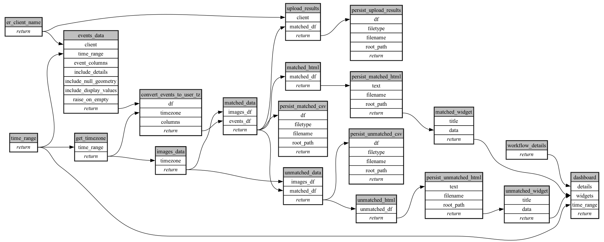

```
# AUTOGENERATED BY ECOSCOPE-WORKFLOWS; see fingerprint in README.md for details

```

```yaml
# fingerprint:
artifacts_sha256_basic: a89bb88daf41512fb7e9543ef7eff3d27c48a70fa44244da75e7f1db8c137630
artifacts_sha256_strict: 0ddfa34f7aba32c54a8791c751c1d721a0d3fa7ce21f8a25f96fbb13ab5cf63e
installed_requirements:
- channel: https://repo.prefix.dev/ecoscope-workflows/
  name: ecoscope-workflows-core
  version: {version: ==0.22.17}
- channel: https://repo.prefix.dev/ecoscope-workflows/
  name: ecoscope-workflows-ext-ecoscope
  version: {version: ==0.22.17}
- channel: https://repo.prefix.dev/ecoscope-workflows-custom/
  name: ecoscope-workflows-ext-custom
  version: {version: ==0.0.39}
- channel: https://repo.prefix.dev/ecoscope-workflows-custom/
  name: ecoscope-workflows-ext-ste
  version: {version: ==0.0.20}
params_sha256: 6c9795acbdc04b9b1f02642acdb4e06f029926797b2ebbe4c551422dd9fdae1a
spec_sha256: 8e24a24a81aaaddf5893366bdaa1d2681135c867497203b01e18f94a7aee7f2f

```

# ecoscope-workflows-aerial-images-workflow


