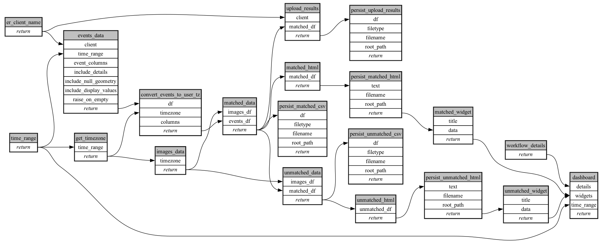

```
# AUTOGENERATED BY ECOSCOPE-WORKFLOWS; see fingerprint in README.md for details

```

```yaml
# fingerprint:
artifacts_sha256_basic: 49816c650bc2cb66df2b742c4ab10eed336805525877361c95ae2cb0eddec3ab
artifacts_sha256_strict: 165d7f464e1e2c8e2e7d9523334c2329bb91b7d2d279f2b04917bf818be8d86b
installed_requirements:
- channel: https://repo.prefix.dev/ecoscope-workflows/
  name: ecoscope-platform
  version: {version: ==2.15.1}
- channel: https://repo.prefix.dev/ecoscope-workflows-custom/
  name: ecoscope-workflows-ext-custom
  version: {version: ==0.1.0rc14}
- channel: https://repo.prefix.dev/ecoscope-workflows-custom/
  name: ecoscope-workflows-ext-ste
  version: {version: ==0.0.0rc1}
- channel: conda-forge
  name: pydeck
  version: {version: ==0.9.2}
params_sha256: e0b481a1cfeead4407bca7139daa29188a38fe62502ca451876db69f94fd8f03
spec_sha256: bd2ba02d8de6d2de20c39d48c0868e2c9c4572d9c8e2bf0f952a5fdb00471e2d

```

# ecoscope-workflows-aerial-images-workflow


